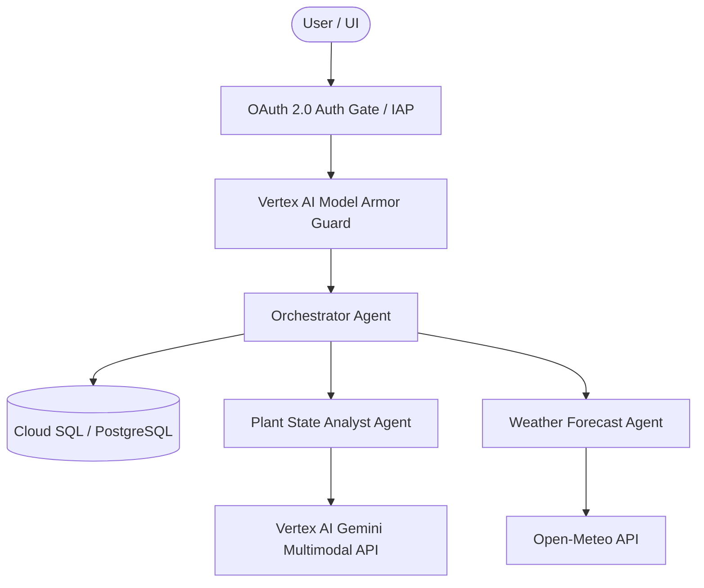

# Agent Spec: Almanac - Smart Yard Watering Agent

## Overview
Almanac is an agentic yard-watering planner that generates highly optimized 7-day watering schedules based on input/photos of a user's yard, their geographical location, plant health/maturity states, and real-time weather forecasts. 

The system utilizes a multi-agent orchestration pattern to split cognitive tasks (image analysis, weather ingestion, and schedule compilation) to operate efficiently and parallelly. It persists user location, yard layout (plants on premises), historical watering plans, and plant removals in a database with strict **user-level isolation** secured by OAuth 2.0. 

---

## Computer Vision (CV) & Multimodal Capability
To identify plants and analyze their maturity/state, we will utilize **Vertex AI's multimodal Gemini models** (e.g., `gemini-2.5-flash` or `gemini-1.5-flash`). Because Gemini is natively multimodal, we do not require a separate CV model or pipeline; the same model performs high-fidelity image understanding directly.

### User Interface Photo Capture (Mobile-first)
The Streamlit frontend will support both desktop and mobile users via:
- **`st.file_uploader`**: Lets users select existing garden photos from their library.
- **`st.camera_input`**: Integrates with mobile device cameras, allowing users to take high-resolution garden photos in real time.
- **Responsive Layout**: Utilizing Streamlit’s native fluid grid systems to fit mobile screen dimensions perfectly.

---

## Safety & Security: Vertex AI Model Armor
To protect the system against prompt injections, jailbreaks, toxic content, and data leakage, we will implement a runner-wide security layer utilizing **Vertex AI Model Armor** (integrated via an ADK safety plugin). This native GCP service acts as a guardrail wrapping all tool calls and LLM invocations for the Orchestrator and specialist agents, preventing session poisoning or unauthorized command execution.

---

## Architecture & Sub-Agents
The system is divided into three specialized agents coordinated by a central Orchestrator, wrapped by a Model Armor safety plugin:

1. **Orchestrator Agent (Coordinator)**:
   - Manages the interaction lifecycle, loads context (location, plant inventory, date) from the database under the current authenticated `user_id`.
   - Coordinates the Plant Analyst and Weather Forecast Agent.
   - Compiles inputs into the final 7-day watering schedule with logical reasoning.
   - Handles plant deletion/addition updates.
   - Triggers the observability and logging metrics.

2. **Plant State Analyst Agent (Specialist)**:
   - **Inputs**: Yard photos (provided via Streamlit file uploader/camera input) or manual text-based plant lists.
   - **Function**: Uses the Vertex AI Gemini Multimodal model to identify plant species, assess maturity (seedling, mature, established), and note current health states (stressed, healthy, dehydrated).

3. **Weather Forecast Agent (Specialist)**:
   - **Inputs**: User's location/coordinates.
   - **Function**: Queries the **Open-Meteo API** to fetch 7-day forecasts.

---

## Data Model & User Isolation (SQL Schema)

To guarantee complete multi-tenant user isolation, every database record is keyed by a `user_id` derived from the OAuth 2.0 session.

### `user_profile`
- `user_id` (TEXT, Primary Key) - OAuth authenticated user subject ID
- `location_name` (TEXT)
- `latitude` (REAL)
- `longitude` (REAL)
- `created_at` (TIMESTAMP)

### `plants`
- `id` (INTEGER, Primary Key)
- `user_id` (TEXT, Index) - Establishes ownership/isolation
- `name` (TEXT)
- `maturity` (TEXT)
- `health_state` (TEXT)
- `photo_path` (TEXT, Optional)
- `added_at` (TIMESTAMP)
- `removed_at` (TIMESTAMP, Optional)

### `watering_plans`
- `id` (INTEGER, Primary Key)
- `user_id` (TEXT, Index) - Establishes ownership/isolation
- `generated_at` (TIMESTAMP)
- `start_date` (TEXT)
- `schedule_data` (JSON/TEXT)
- `reasoning_summary` (TEXT)

---

## GCP Deployment Architecture & Terraform Infrastructure
For production deployment on Google Cloud Platform, the system is provisioned via **Terraform** and utilizes:

1. **Frontend App**: Streamlit web app deployed on **Cloud Run** with **Identity-Aware Proxy (IAP) / OAuth 2.0** enabled for managed user authentication and secure routing.
2. **Agent Backend**: Custom ADK agents packaged and running on **Agent Runtime (Vertex AI Reasoning Engine)**, enabling serverless agent execution.
3. **Database**: Managed **Cloud SQL for PostgreSQL** instance for durable, highly available session persistence, using IAM database authentication.
4. **CI/CD & Observability**: Complete GitHub Actions integration utilizing Workload Identity Federation (WIF). Full tracing and telemetry exported to **Google Cloud Trace** and **Cloud Logging** via OpenTelemetry.

---

## Example Use Cases
### Use Case 1: Initial Yard Setup & Analysis
- **User input**: Photo of yard + "I live in Seattle, WA".
- **Plant Analyst**: Identifies "Hydrangeas (mature, slightly wilted)" and "Lavender (mature, healthy)".
- **Weather Forecast Agent**: Pulls Seattle 7-day forecast (high precipitation on Day 3 & 4).
- **Orchestrator**: Inserts profile and plants into the database under the current `user_id`. Synthesizes Seattle rain forecast and hydrangeas state to draft a schedule: "Hydrangeas need immediate watering today due to wilting, but skip Day 3-5 because of heavy rainfall. Lavender requires zero watering this week."

### Use Case 2: Plant Removal Update
- **User input**: "I removed the Hydrangea from my yard."
- **Orchestrator**: Updates the database to mark the Hydrangea's `removed_at` with the current timestamp under the authenticated `user_id`.
- **Result**: Future plans exclude the Hydrangea for this user.

---

## Tools Required

1. **Weather Tool (`get_7_day_forecast`)**:
   - **API**: Open-Meteo (Free, public, no auth)
   - **Endpoint**: `https://api.open-meteo.com/v1/forecast`
   - **Inputs**: `latitude`, `longitude`
   - **Outputs**: High/Low temps, daily rain precipitation sums, wind speed.

2. **Geocoding Tool (`get_coordinates`)**:
   - **API**: Open-Meteo Geocoding API (Free)
   - **Endpoint**: `https://geocoding-api.open-meteo.com/v1/search`
   - **Inputs**: `location_name`
   - **Outputs**: `latitude`, `longitude`.

---

## Constraints & Safety Rules
- **No Hallucinations**: Do not assume local weather patterns or plant needs. If the location is ambiguous (e.g. "Springfield"), the Orchestrator MUST ask the user to specify their state or region.
- **Safety**: Do not recommend overwatering (e.g. watering lavender daily), which causes root rot.
- **Vision Limitations**: If a photo is blurry or unclear, the Plant Analyst must explicitly list the plants it is uncertain about and prompt the user to confirm or edit.

---

## Success Criteria
- **User Isolation**: Users are fully sandboxed and can only view/update their own profiles and yard states.
- **Statefulness**: Successfully remembers previous yards/locations when the app is restarted.
- **Responsiveness**: Renders watering plans clearly in a Streamlit dashboard.
- **Traceability**: All agent runs, sub-agent delegations, and tool calls are fully traced via OpenTelemetry / Vertex AI Tracing.
- **Deployability**: Complete Dockerfile, CI/CD GitHub Actions config, and setup scripts are fully ready for Cloud Run and Agent Runtime.

---

## Reference Samples
- `core/python/safety-plugins` — For input/output guardrails using Vertex AI Model Armor.
- `core/python/oauth-user-consent-flow` — For managed OAuth 2.0 user-scoped flows.
- `core/python/cross-session-memory` — For robust schema-based persistence patterns.
- `core/python/long-horizon-harness` — For delegation protocols and scheduling/orchestration.
